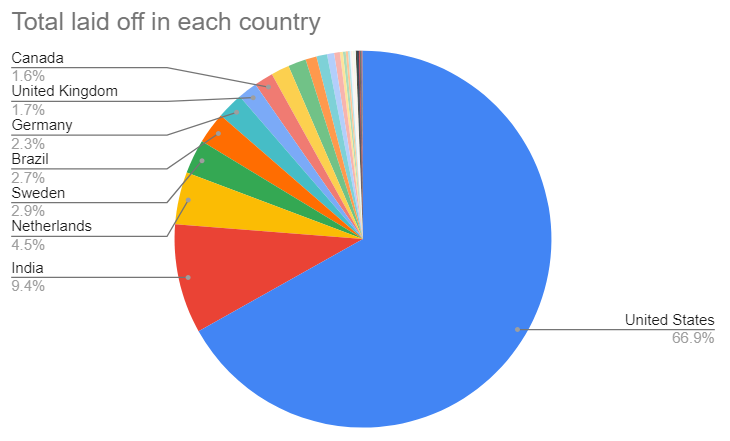
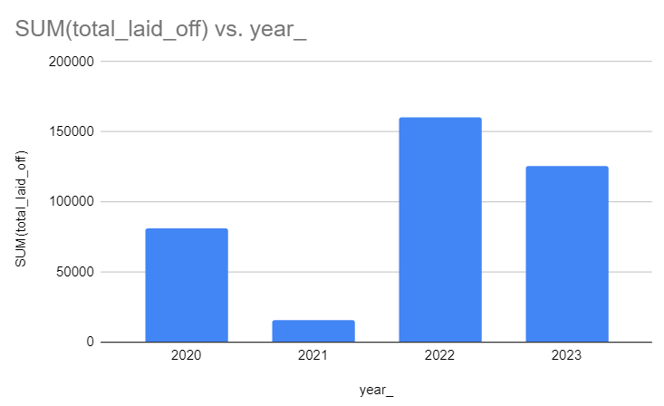

# World-Layoffs--Data-Analysis-using-SQL

## Table of Contents

- [Project Overview](#project-overview)
- [Data Source](#data-source)
- [Tools](#tools)
- [Data Cleaning](#data-cleaning)
- [Exploratory data analysis](#exploratory-data-analysis)
- [Results](#results)
- [References](#references)

### Project Overview
---

The primary goal of this project is to analyze global layoff data to identify trends, patterns, and insights. This analysis will help understand the factors influencing layoffs, the industries most affected and geographical trends.


### Data Source
---

Layoffs Data: The primary dataset used for this analysis is the "layoffs.csv" file, containing detailed information about the number of layoffs and the percentage layoffs made by each company.

### Tools
---

SQL Server - Data Cleaning and Data Analysis

### Data Cleaning
---


1. Removing Duplicates

    To identify duplicates we will add one column named row_num which will specify the number of duplicate rows.
    ```sql
    select *,
    row_number() over(
    partition by company, location,industry,total_laid_off,percentage_laid_off,date,stage,country,funds_raised_millions)
     as row_num
    from layoffs_staging
    ```
    The rows having row_num > 1 are deleted.

2. Standardizing the rows
   
  - Industry column cantained entries such as 'Crypto', 'Cryptocurrency', and 'Crypto Currency', each referring to the same sector which were consolidated into a 
    single term, 'Crypto'.Similarly for country column 'United States' and 'United States.' were consolidated into 'United State'.
  - The data type of date was changed into 'date' from 'text'.

3. Removing null and blank values

  -  Cases were found where companies had multiple entries, some of which were missing industry information while others were correctly categorized. To rectify these inconsistencies, I used self join to automatically fill all the null values in industry section.
    
```sql
update layoffs2 t1 join layoffs2 t2
on t1.company=t2.company
set t1.industry=t2.industry
where t1.industry is null
and t2.industry is not null;
```

4. Removing unwanted data and columns
   
- Rows where total_laid_off and perentage laid-off are null were deleted.
- row_num column was altered.

### Exploratory data analysis
---
- 
```sql
SELECT MAX(date),  MIN(date)
FROM world_layoffs.layoffs2;
```
The dataset records layoff data spanning from 2020-03-11 to 2023-03-06. This period captures significant global economic events, including the impacts of the COVID-19 pandemic, which began in early 2020, and the subsequent economic recovery phases. Analyzing data from this timeframe provides valuable insights into how different industries and regions were affected by these challenges.

-
```sql
SELECT *
FROM world_layoffs.layoffs2
WHERE  percentage_laid_off = 1;
```
The SQL query results indicate that the majority of companies that laid off their entire workforce (100% layoffs) are startups because the stage mentioned are early and they don't have much funds for the company.

- Companies with the highest layoff in a single day are Google(12000), Meta(11000), Amazon(10000), Microsoft(10000), Ericsson(8500).
- Companies with most total layoffs: Here Amazon had the highest total layoff of 18150
- United states had the highest number of layoffs in these 3 years.

```sql
  SELECT country, SUM(total_laid_off)
  FROM world_layoffs.layoffs2
  GROUP BY country
  ORDER BY 2 DESC;
```

<p>
  
</p>

- Total Layoffs with respect to Year
  
```sql
  SELECT YEAR(date) as year_, SUM(total_laid_off)
  FROM world_layoffs.layoffs2
  GROUP BY YEAR(date)
  having year_ is not null
  ORDER BY 1 ASC;
 ```
<p>
  
</p>

The results depicted thatcomparitively 2020 and 2023 had most number of layoffs.


    


